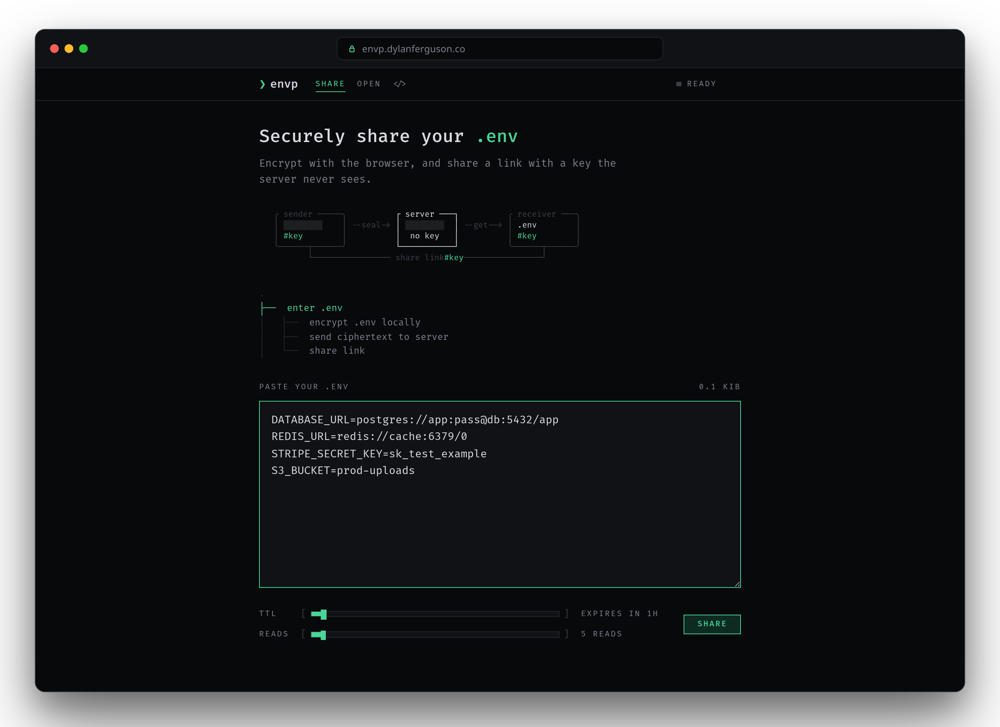

<p align="center">
  
</p>

<h1 align="center">envp</h1>

<p align="center">
  Browser-encrypted <code>.env</code> sharing.<br>
  The key stays in the URL fragment. The server never sees it.
</p>

<p align="center">
  <a href="https://envp.dylanferguson.co">envp.dylanferguson.co</a>
</p>

<p align="center">
  
</p>

Paste a `.env`. The browser encrypts it. You get a link with the key after `#`. The server stores ciphertext, an expiry, and a bound on how many times the blob may be fetched.

## Run locally

```bash
mise install
vp install
mise run dev
```

UI on [http://127.0.0.1:5173](http://127.0.0.1:5173), API on `:8080`.

## Docker

```bash
docker compose up --build
```

App on [http://127.0.0.1:8080](http://127.0.0.1:8080). Set `PUBLIC_ORIGIN` when the hostname is not localhost.
